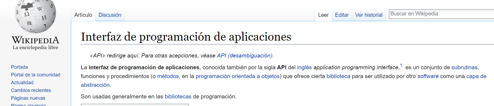

```{r setup, include=FALSE}
knitr::opts_chunk$set(echo = TRUE)
```

<section><h1>Acceso a los datos con R</h1>

## Maneras de acceder a los datos

- Datos que directamente importas hacia R (Excel, txt, csv, shape, json, etc.)
- Datos de un repositorio propio de base datos (ej.: SQL)
- Datos que se bajan directamente de una URL (o usando la función download.file())
- Los datos que descarga mediante una API que realiza una solicitud a un repositorio de datos y devuelve los datos solicitados

## Dos principales formatos

- Archivo tabular de lectura humana (tienen una estructura plana en lugar de una jerárquica)
- Archivos estructurados legibles por máquina

</section>

---

<section><h1>¿Qué es una API?</h1>

API es el acrónimo de Application Programming Interface, que es un intermediario de software que permite que dos aplicaciones se comuniquen entre sí.





## Un lenguaje común de comunicación

Las entradas y salidas variarán entre las API, pero el proceso es el mismo: se envía una "solicitud" que sigue ciertas reglas programáticas y se devuelve una "respuesta" que contiene contenido en un formato esperado.


## Endpoints
El primer paso es localizar el endpoint deseado de la API.
La mayoría de las APIs tienen documentación online que explican que tipo de información puede ser requerida.
Ejemplo: API Banco Mundial:


## Request


## Response

## Mejores prácticas
Las claves principales de cualquier API son la estructura de las solicitudes y la estructura de las respuestas. Una solicitud HTTP consiste en las siguientes partes:

- verbos HTTP (GET, POST, DELETE, etc.)
- La URL base de la API
- El path o endpoint de interés
- Si la URL tiene argumentos query (e.g., ?foo=bar)
- Optional headers
- Conocer el estado de la respuesta
(ver: https://cran.r-project.org/web/packages/httr/vignettes/api-packages.html)

## Errores

- 1XX: informacional
- 2XX: éxito!
- 3XX: error de cliente (error nuestro!)
- 4XX: errores de servidor (error de la API)


</section>

---

<section><h1>Extraer datos de APIs con R: las básicas</h1>

### Los principales paquetes

- RCurl, httr
- JSON: jsonlite, rjson
- XML: XML, R4X

### Herramientas específicas de datos de APIs 

- Google: RGA, googleVis, translate, others
- twitteR (Twitter)
- Rook / Rfacebook (Facebook)
- tumblR (Tumblr)
- Otros: dvn (Dataverse), WDI (World Bank), etc. (<small>ver: http://cran.r-project.org/web/views/WebTechnologies.html</small>)

</section>

---

<section><h1>Ejemplo datos de clima con: RCurl y rjson</h1>

## Objetos a crear necesarios para bajar datos de clima. La API requiere autentificación (clave)
```{r}
library(RCurl)
library(rjson)
key='5a9bd6cf09ce38ec2755e059ab9944af'
pais='BR'
ciudad = 'Curitiba'
url_base="http://api.openweathermap.org/data/2.5/weather?q="
```
## Obtener los datos del clima para Brasil
```{r}
URL = paste0(url_base,ciudad,',',pais,'&APPID=', key)
d= fromJSON(getURL(URL))
print(d)
```

## Podemos hacerlo como una función y aplicar la función a varias ciudades
```{r}
myfun <- function(ciudad){
  url = "http://api.openweathermap.org/data/2.5/weather?q="
  pais = 'BR'
  key = '5a9bd6cf09ce38ec2755e059ab9944af'
  URL = paste0(url, ciudad, ',', pais,'&APPID=',key)
  d=getURL(URL)
  d=(fromJSON(d))
}
ciudades=c('Curitiba', 'Brasilia')
b <- lapply(ciudades, myfun)
print(b)
df <- plyr::ldply (b, data.frame)
```
---

<section><h1>Ejemplo datos de Banco Mundial con: httr</h1>

API keys or other special authentication methods are no longer necessary to access the API.
Endponit: countries API query
  For XML format: http://api.worldbank.org/v2/countries/br
  For JSON format: http://api.worldbank.org/v2/countries/br?format=json

```{r}
library(httr)
url_base_wb <- "http://api.worldbank.org/v2"
pais <- "br"
query_pais <- sprintf("countries/%s?format=json", pais)
url_pais <- paste0(url_base_wb, "/", query_pais)
tmp_pais <- GET(url_pais)
datos_pais <- content(tmp_pais)
print(datos_pais)
```
</section>