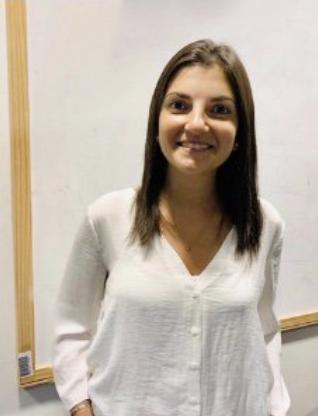

```{r setup, include=FALSE}
knitr::opts_chunk$set(echo = FALSE)
```

## <span style="color:#88398A"> ¿Qué es R-Ladies?</span> 

Es una organización internacional que promueve la diversidad de género en la comunidad de R a través de reuniones presenciales, virtuales y mentorías en un espacio amigable y seguro.


## <span style="color:#88398A"> ¿Por qué R-Ladies?</span> 

Nosotras estamos subrepresentadas en cada rol en la comunidad R:

1. desarrollo de paquetes
2. conferencistas invitadas
3. integrantes de comités
4. moderadoras
5. panelistas invitadas
6. dictado de tutoriales
7. posiciones de liderazgo en general

## <span style="color:#88398A"> Misión</span> 

Tener iniciativas con perspectiva de género incentiva a dichas minorías a participar más como oradoras, programadoras, líderes etc.


## <span style="color:#88398A">R-Ladies Global</span> 
- Iniciativa generada en 2012 en San Francisco (https://rladies.org).

- Actualmente hay 159 capítulos en 47 países y 47356 miembros (https://gqueiroz.shinyapps.io/rshinylady/).


## <span style="color:#88398A">R-Ladies Montevideo</span> 

- Empezamos: 2 Junio de 2017
- 195 miembros en meetup
- Primer meetup: 30 de Agosto de 2017


## <span style="color:#88398A">R-Ladies Montevideo equipo</span>

- María Inés Fariello
- Paula Pereda
- Daniela Vazquez
- Natalia da Silva

## <span style="color:#88398A">R-Ladies Montevideo</span>

- Meetup: rladies.uy

- twitter: @RLadiesMVD

- facebook: RLadiesMVD 

- email:montevideo@rladies.org

- GitHub: https://github.com/rladies/meetup-presentations_montevideo

- Slack: rladies-mvd.slack.com (enviar correo para que las invitemos)


## <span style="color:#88398A">Conferencias</span>

- useR 2019: Conferencia internacional de usuarios de R. 9-12 de Julio Touluse, Francia.

- LatinR: Conferencia Latinoamericana de usuarios de R para investigación y desarrollo. 25-27 Septiembre. Santiago, Chile (http://latin-r.com,  @LatinR_Conf)


- KHIPU: Latin American Meeting In Artificial Intelligence. 11-15 de Niviembre. Montevideo, Uruguay (https://khipu.ai)


## <span style="color:#88398A">Invitada</span>
\centering

