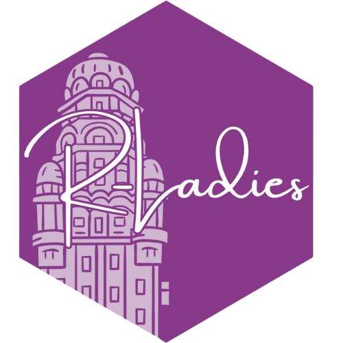

 

# Archivos de los encuentros de R-Ladies Montevideo
 
  R-Ladies Montevideo fue fundado en Junio de 2017.
  
  Co-organizadoras: Natalia da Silva, Daniela Vázquez, Paula Pereda, María Inés Fariello, Valentina Colistro y Virginia Recagno.
  
Por más información escribinos a montevideo@rladies.org!

  
# 2024 

**2. Taller de Quarto**

*Lunes 10 de Junio 18:30 hs, presencial*

+ Paula Pereda: [Presentacion: Hola Quarto!](https://paula.quarto.pub/hola-quarto/#/hello-quarto-title); [Ejercicios](https://github.com/paulapereda/hola-quarto-soluciones)

**1. Primer encuentro**

*Lunes 27 de Mayo 7:00 hs, presencial*

+ Paula García: [*Reportando con R y Quarto en la gestión de la crisis hídrica*](https://github.com/rladies/meetup-presentations_montevideo/blob/master/2024-05-27/R-Ladies_paula-garcia.html)
+ Paula Pereda: [*Datos pero que sean de moda*](https://github.com/rladies/meetup-presentations_montevideo/blob/master/2024-05-27/Paula_Pereda.pdf)
+ Virginia Recagno: [* Natural alero: análisis geoespacial del arbolado público en la ciudad de Montevideo*](https://github.com/rladies/meetup-presentations_montevideo/blob/master/2024-05-27/Arbolado.html)

# 2023

**Esfuerzos concentrados en LatinR2023 en Montevideo**
[**Info de LatinR**](https://latin-r.com)

# 2022

**1. R-encuentro RLadies & GURU**

*Miércoles 29 de Noviembre 18:00 hs, presencial*

+ Natalia da Silva [**Presentación RladiesMVD y GURU**](https://github.com/rladies/meetup-presentations_montevideo/blob/master/2022-11-29/RladiesMVD_GURU)
+ Valentina Franco-Trecu [**Comportamiento de buceo en lobos marinos**]()
+ Mauro Loprete [**Paquete metaSurvey, para procesar encuestas mediante metaprogramación**]()
+ Cecilia Bardier [**Modelos bayesianos con JAGS desde R**]()
+ Juan Manuel Barreneche [**Las mil y un maneras de ingresar mal los datos: la historia de una app de validación**]()
  
# 2021

**2. ¡Por favor... Dibújame un proyecto!**

*Lunes 27 de Setiembre 2021*

+ Maëlle Salmon: [*Presentación*](https://rladiesmvd-maelle.netlify.app/#/), [*Grabación*](https://github.com/rladies/meetup-presentations_montevideo/blob/master/2022-11-29/Maelle.mp4)

**1. Taller: datos Geoespaciales en R**

*Miércoles 20 de Mayo, 6:00 hs, virtual*

+ María Teresa Ortíz: [*Presentación*](https://mapas-rladies-mv.netlify.app); [*Proyecto de Rstudio Cloud*](https://rstudio.cloud/project/2488557); [*Grabación*](https://www.youtube.com/watch?v=_pFrWCqTKec&t=3s).

# 2020 

**3. Personalizá tus gráficas con ggplot2**
  
*Miércoles 9 de Diciembre, 6:30 hs, virtual*
+ Maggie Suero: [*Presentación*](https://github.com/maggiesuero/Rprojects)
 
**2. Primeros pasos en el análisis de datos en R!**
  
*Jueves 28 de Mayo,6:00, Virtual*
  
+ Daniela Vazquez: ; [*Proyecto de Rstudio Cloud*](https://rstudio.cloud/project/1327203); [*Grabación*](https://www.youtube.com/watch?v=BqNuFWCx4cg&t=14s)
 
**1. Watch party: RStudio::conf 2020**
  
*Miércoles 29 de Enero, 1:00 hs, FING*

# 2019

**3. Despedida de año! R-ladies & GURU::mvd**
 
*Lunes 9 de diciembre, 19 hs, La diaria Lab*
 
+ [*Charlas relámpago*]()

**2. R & Education**
 
*Miércoles 27 de noviembre, 19 hs, Tryolabs*
 
+ [*Novedades R-Ladies*](https://github.com/rladies/meetup-presentations_montevideo/blob/master/2019-11-26-Edu/Presentaci_n_RLadies.pdf)
 
+ Cecilia García e Ivana Marsicano: [*La Ruta R del Programa de Evaluación y Estadística de la UTEC*](https://github.com/rladies/meetup-presentations_montevideo/blob/master/2019-11-26-Edu/Cecilia_Ivana.pdf)
+ Natalia da Silva: [*Evaluación y Monitoreo de plataformas educativas con Shiny app*](https://github.com/rladies/meetup-presentations_montevideo/blob/master/2019-11-26-Edu/Natalia_da_Silva.pdf)
+ Gullermina Costabel: [*Análisis de Supervivencia de las tablets del Plan Ceibal*]()
 
**1. Taller introductorio a Shiny: aplicaciones web interactivas en R**
 
*Miércoles 29 de mayo, 19.00 hs, Scanntech*
 
+ [*Novedades R-Ladies 2019*](https://github.com/rladies/meetup-presentations_montevideo/blob/master/2019-05-29-shiny/R-Ladies_MVD_primer_encuentro.pdf)
+ Virginia Burguete: [*Taller introductorio a Shiny: aplicaciones web interactivas en R*](https://github.com/rladies/meetup-presentations_montevideo/blob/master/2019-05-29-shiny/taller_shiny/documentation/Shiny.pdf)
 
# 2018
 
**4. Taller de manipulación y transformación de datos con tidyverse**
 
*Martes 23 de octubre, 19:00 hs, Scanntech*
 
+ Lucía Coudet: [*Taller de manipulación y transformación de datos con tidyverse*](https://github.com/rladies/meetup-presentations_montevideo/blob/master/2018-10-23-tidyverse/rladies_tidyverse.pdf)
 
**3. Primer aniversario R-Ladies Montevideo**

*Jueves 30 de agosto, 19:00 hs, Pyxis*

+ Silvana Fumega: [*Estandarización de datos de femicidios en Latinoamérica*](https://github.com/rladies/meetup-presentations_montevideo/blob/master/2018-08-30-1er_a%C3%B1o/G%C3%A9nero_datos_seguridad_silvana.pdf)
+ Gabriela Mathieu: [*Aplicación Shiny: Cartografía digital de feminicidios en Uruguay*](https://github.com/rladies/meetup-presentations_montevideo/blob/master/2018-08-30-1er_a%C3%B1o/Shiny_feminicidios_Gabriela.pdf)
+ Elina Gómez: [*Acoso sexual callejero. Análisis cualitativo usando R*](https://github.com/rladies/meetup-presentations_montevideo/blob/master/2018-08-30-1er_a%C3%B1o/Acoso_callejero_Elina.pdf)
 
**2. Taller R Markdown: informes dinámicos y reproducibles**
  
*Jueves 7 de junio, 19:00 hs, Ingenious.*

+ [Paula Pereda](https://twitter.com/paubgood): [*“informes dinámicos y reproducibles en R”*](2018-06-07-rmarkdown).  
   
 
**1. Visualización de Secuencias Biológicas + Modelos Mixtos**
    
*Jueves 12 de abril de 2018, 19:00 hs.*

+ [*Novedades R-Ladies*](https://github.com/rladies/meetup-presentations_montevideo/blob/master/2018-04-12-charlas/R-Ladies2018.pdf)

+ [Florencia Díaz Viraqué](https://twitter.com/fdiazviraque): [*"Código y paquetes para el análisis y visualización de secuencias biológicas en R" (más alguna joyita!)*](https://github.com/rladies/meetup-presentations_montevideo/blob/master/2018-04-12-charlas/florencia.pdf).
  
+ Fiorella Cavalieri: [*"Modelos mixtos, ¿mlne o ml4?"*](https://github.com/rladies/meetup-presentations_montevideo/blob/master/2018-04-12-charlas/Modelos%20mixtos_11_4_18_2.pptx)
  

# 2017
  
**3. Visualización de datos genómicos + NASA Datanauts**
    
*Miércoles 13 de diciembre de 2017, 19:00 hs, Pyxis.*

+ [*Novedades R-Ladies*](https://github.com/rladies/meetup-presentations_montevideo/blob/master/2017-12-13-Viz_genomics%2BNASADatanauts/2017-13-12-R-LadiesMVD.pdf)

+ [Maine Fariello](https://twitter.com/mainefariello): [*“Visualización de datos genómicos”*](2017-12-13-Viz_genomics%2BNASADatanauts/17-12-RLadies-VizGenomica.pdf). 
  
  
+ [Daniela Vázquez](https://twitter.com/d4tagirl): [*“Cómo me metí en la tecnología por la ventana y en la NASA por la banderola”*](https://docs.google.com/presentation/d/1YBmleq5a0211rYbhq4krHeKOfy5M6bf5gjKpbqZ26io/edit?usp=sharing). 
  
  
**2. Taller: Visualización de datos con ggplot2**
  
*Miércoles 15 de noviembre de 2017, 19:00 hs, Sophilabs.*

+ [Natalia da Silva](https://twitter.com/pacocuak): [*“Visualización de datos con ggplot2”*](2017-11-15-ggplot2).  
  
  
**1. Kickoff: Qué es R-Ladies + aplicaciones de R en ecología, estadística y agronomía**
    
*Miércoles 30 de agosto de 2017, 19:00 hs, Sophilabs.*

+ [*Bienvenidas R-Ladies!*](2017-08-30-kickoff/2017-08-30-R-LadiesMVD-Presentation.pdf)

+ [Carolina Crisci](http://www.cure.edu.uy/sites/default/files/Carolina%20CrisciSEMBLANZA%20DOCENTE%20CURE%20.pdf): [*“Modelando en Ecología: aplicaciones usando R”*](2017-08-30-kickoff/Crisci.pdf).  

+ [María Eugenia Riaño](http://www.iesta.edu.uy/wp-content/uploads/2017/04/CV_EUGENIA_RIANIO.pdf): [*“Análisis de Muestras complejas en R”*](2017-08-30-kickoff/Riaño.pdf).  
  
+ [Natalia Berberian](http://www.fagro.edu.uy/images/stories/Dpto_Biometria_Estadistica/CVuy/Berberian-Natalia.pdf) y [Alejandra Borges](http://www.fagro.edu.uy/posgrados/CVs/No%20pertenecen%20al%20SNI/Borges,%20Alejandra.pdf): [*“Modelos espaciales en el contexto de diseño de experimentos”*](2017-08-30-kickoff/Borges-Berberian.pptx).  

